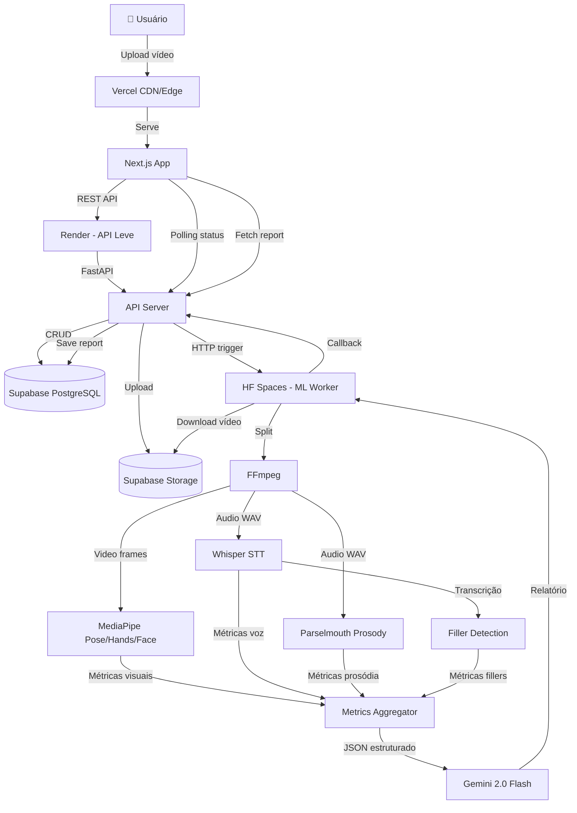
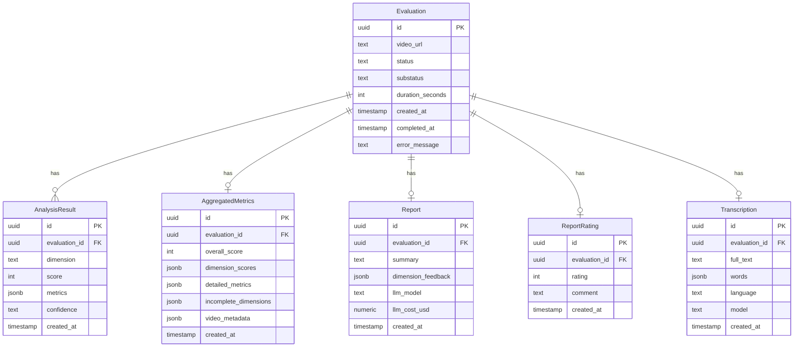
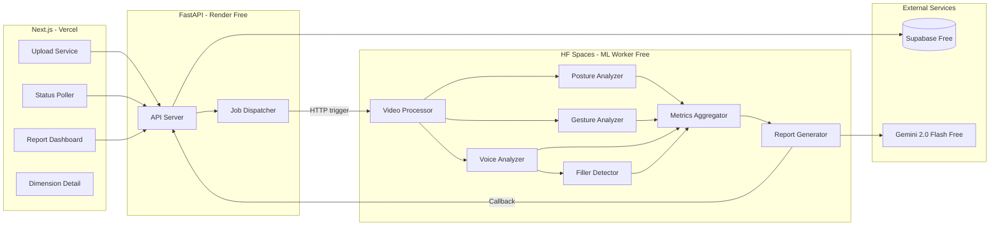
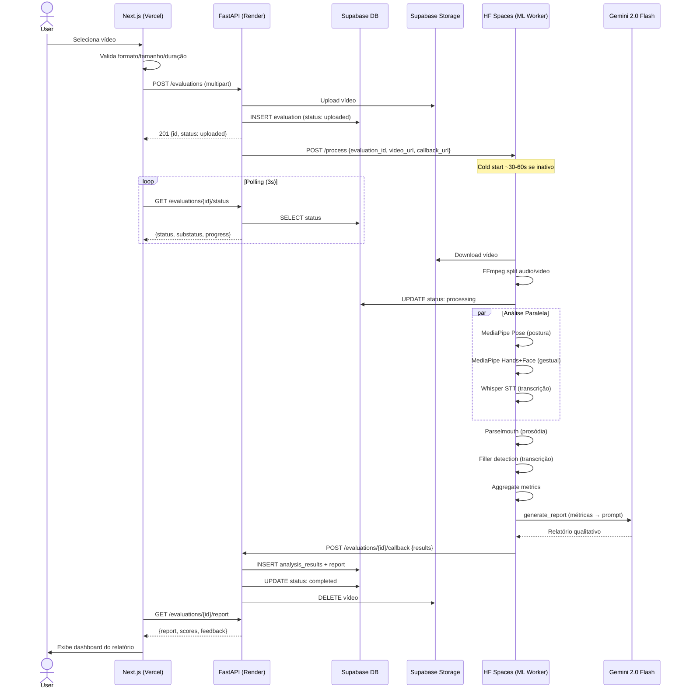
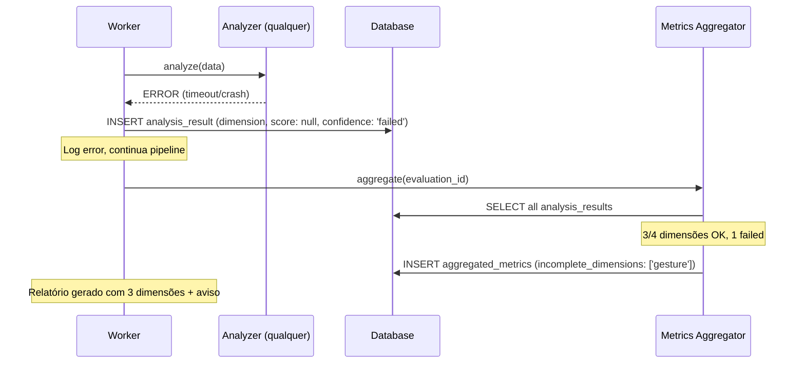

# Oratória Avaliador — Fullstack Architecture Document

## Introduction

Este documento define a arquitetura completa do Oratória Avaliador — uma plataforma que avalia oratória em vídeo usando IA. Cobre backend (Python/FastAPI), frontend (Next.js), pipeline de processamento assíncrono e integrações com serviços de ML/IA.

**Starter Template:** N/A — Greenfield project

### Change Log

| Date | Version | Description | Author |
|------|---------|-------------|--------|
| 2026-03-30 | 0.1 | Draft inicial — YOLO mode | @architect (Aria) |
| 2026-03-30 | 0.2 | Arquitetura custo zero: Railway→Render+HF Spaces, Claude→Gemini | @architect (Aria) |

---

## High Level Architecture

### Technical Summary

Aplicação fullstack com arquitetura de 4 camadas: frontend Next.js servido via Vercel, API leve Python/FastAPI hospedada no Render (free tier), ML worker pesado no Hugging Face Spaces (free, 16GB RAM), e Supabase como backend-as-a-service (PostgreSQL, Auth, Storage). O pipeline de processamento segue o padrão split worker: upload chega na API leve (Render) que dispara processamento no HF Spaces via HTTP. O ML worker executa análise em 4 dimensões (MediaPipe, Whisper, Parselmouth, regex/NLP) e alimenta o Gemini 2.0 Flash (free tier) para gerar feedback qualitativo. A separação API/ML worker permite que o endpoint leve rode em free tier limitado (512MB) enquanto o processamento pesado usa os 16GB do HF Spaces.

### Platform and Infrastructure Choice

**Platform:** Vercel (frontend) + Render (API) + Hugging Face Spaces (ML) + Supabase (database/auth/storage)

**Key Services:**
- **Vercel** — Hosting Next.js com edge network, SSL automático, preview deploys. Free tier: 100GB bandwidth
- **Render** — Hosting FastAPI leve (upload, status, report). Free tier: 750h/mês, 512MB RAM, spin down após 15min inatividade
- **Hugging Face Spaces** — ML worker com Gradio/FastAPI. Free tier: 16GB RAM, 2 vCPUs, spin down após inatividade (~30s cold start)
- **Supabase** — PostgreSQL managed, Auth, Storage (vídeos temporários). Free tier: 500MB DB, 1GB storage

**Deployment Regions:** Auto (Vercel edge) / Oregon (Render) / US (HF Spaces) / US-East (Supabase)

**Rationale:** Stack 100% gratuita para MVP. Vercel free para frontend, Render free para API leve, HF Spaces free para processamento pesado (16GB RAM suporta Whisper+MediaPipe), Supabase free para DB/storage. Total estimado: **$0/mês**.

**Trade-offs do custo zero:**
- Cold starts: Render (~30s) e HF Spaces (~30-60s) fazem spin down após inatividade
- 512MB RAM no Render: suficiente para API que só roteia, insuficiente para ML (por isso o split)
- HF Spaces: público por default no free tier (sem dados sensíveis no worker)

### Repository Structure

**Structure:** Monorepo (sem monorepo tool)

**Rationale:** Com apenas 2 apps (web + api) em linguagens diferentes (TS + Python), um monorepo tool (Turborepo, Nx) adiciona complexidade desnecessária. Basta uma estrutura de diretórios organizada com scripts no root `package.json`.

### High Level Architecture Diagram



### Architectural Patterns

- **Split Worker Pattern:** API leve (Render) separa da ML pipeline (HF Spaces). API faz roteamento e persistência; HF Spaces faz processamento pesado. _Rationale:_ Free tiers têm limites de RAM diferentes. API precisa de pouca RAM; ML precisa de 4-8GB. Split permite usar o melhor de cada free tier.
- **HTTP Trigger + Callback:** API dispara processamento via HTTP POST para HF Spaces. HF Spaces processa e chama callback na API com resultados. _Rationale:_ Mais simples que job queue; funciona cross-service sem Redis.
- **Pipeline Pattern:** Processamento em etapas sequenciais (split → análise paralela → agregação → LLM). _Rationale:_ Cada etapa é independente, testável e pode falhar sem derrubar o pipeline inteiro (degradação graceful).
- **BFF Implícito:** Next.js API routes podem servir como proxy leve para o backend Python se necessário. _Rationale:_ Evita CORS issues e permite caching no edge.
- **Repository Pattern (Python):** Camada de acesso a dados abstraída em repositórios. _Rationale:_ Facilita testes unitários e eventual troca de storage.

---

## Tech Stack

| Category | Technology | Version | Purpose | Rationale |
|----------|-----------|---------|---------|-----------|
| Frontend Language | TypeScript | 5.x | Type safety no frontend | Padrão Next.js, previne bugs em runtime |
| Frontend Framework | Next.js | 14+ | App Router, SSR, API routes | Melhor DX para React, deploy trivial no Vercel |
| UI Styling | Tailwind CSS | 3.x | Utility-first CSS | Rápido para prototipar, sem overhead de component library |
| UI Components | shadcn/ui | latest | Componentes acessíveis | Copy-paste, sem dependência de lib, WCAG AA |
| State Management | React hooks + Context | built-in | Estado local e compartilhado | Sem necessidade de lib externa para MVP |
| Backend Language | Python | 3.11+ | Pipeline de ML/processamento | Ecossistema ML (MediaPipe, Whisper, Parselmouth) |
| Backend Framework | FastAPI | 0.110+ | API REST assíncrona | Async nativo, OpenAPI auto, tipagem com Pydantic |
| API Style | REST | OpenAPI 3.0 | Comunicação frontend-backend | Simples, bem suportado, geração automática de docs |
| Database | PostgreSQL (Supabase) | 15+ | Persistência de dados | Managed, free tier, Auth + Storage inclusos |
| File Storage | Supabase Storage | - | Vídeos temporários | Integrado com Supabase, S3-compatible |
| Authentication | Supabase Auth | - | Login/registro (futuro) | Sem auth no MVP, mas infraestrutura pronta |
| ML — Pose | MediaPipe | 0.10+ | Pose/Hands/Face estimation | Open source, roda em CPU, Google-maintained |
| ML — STT | OpenAI Whisper | large-v3/medium | Speech-to-text PT-BR | SOTA para STT multilíngue, roda local |
| ML — Prosody | Parselmouth | 0.4+ | Análise prosódica (F0, intensidade) | Python wrapper para Praat, padrão acadêmico |
| ML — LLM | Gemini 2.0 Flash (Google) | latest | Geração de relatório qualitativo | Free tier (15 RPM), boa qualidade em PT-BR, custo zero |
| Video Processing | FFmpeg | 6+ | Split audio/vídeo, extração de frames | Padrão da indústria, eficiente |
| Backend Testing | pytest | 8+ | Testes unitários e integração | Padrão Python, fixtures, async support |
| Frontend Testing | Vitest | 1+ | Testes unitários de componentes | Rápido, compatível com Vite/Next.js |
| E2E Testing | Playwright | 1.40+ | Testes end-to-end do fluxo | Cross-browser, headless, bom para CI |
| Linting (FE) | ESLint + Prettier | 9+ / 3+ | Qualidade de código TS | Padrão Next.js |
| Linting (BE) | Ruff | 0.4+ | Qualidade de código Python | Extremamente rápido, substitui flake8+isort+black |
| CI/CD | GitHub Actions | - | Build, test, deploy | Integrado com GitHub, free tier generoso |
| Logging | structlog (Python) | 24+ | Logging estruturado backend | JSON logs, contexto automático |
| Monitoring | Sentry | latest | Error tracking | Free tier, boa integração com Next.js e Python |

---

## Data Models

### Evaluation

**Purpose:** Representa uma avaliação de vídeo — o objeto central do sistema.

```typescript
interface Evaluation {
  id: string;              // UUID
  video_url: string;       // URL no Supabase Storage
  status: EvaluationStatus;
  substatus?: string;      // Etapa atual do processamento
  duration_seconds?: number;
  created_at: string;
  completed_at?: string;
  error_message?: string;
}

type EvaluationStatus =
  | 'uploaded'
  | 'processing'
  | 'analyzed'
  | 'completed'
  | 'error';
```

### AnalysisResult

**Purpose:** Resultado de uma dimensão de análise individual.

```typescript
interface AnalysisResult {
  id: string;
  evaluation_id: string;
  dimension: AnalysisDimension;
  score: number;           // 0-100
  metrics: Record<string, any>;  // Métricas específicas da dimensão
  confidence: 'high' | 'medium' | 'low';
  created_at: string;
}

type AnalysisDimension = 'posture' | 'gesture' | 'voice' | 'fillers';
```

### AggregatedMetrics

**Purpose:** Métricas consolidadas de todas as dimensões, input para o LLM.

```typescript
interface AggregatedMetrics {
  id: string;
  evaluation_id: string;
  overall_score: number;          // 0-100 (média ponderada)
  dimension_scores: Record<AnalysisDimension, number>;
  detailed_metrics: Record<AnalysisDimension, any>;
  incomplete_dimensions: AnalysisDimension[];
  video_metadata: {
    duration_seconds: number;
    frames_processed: number;
    audio_duration_seconds: number;
  };
  created_at: string;
}
```

### Report

**Purpose:** Relatório qualitativo gerado pelo LLM.

```typescript
interface Report {
  id: string;
  evaluation_id: string;
  summary: string;                // Resumo geral (2-3 frases)
  dimension_feedback: Record<AnalysisDimension, DimensionFeedback>;
  llm_model: string;              // Modelo usado (haiku/sonnet)
  llm_cost_usd: number;           // Custo da chamada
  created_at: string;
}

interface DimensionFeedback {
  score_label: string;            // "Bom", "Precisa atenção", etc
  strengths: string[];
  improvements: string[];
  tip: string;                    // Dica prática acionável
}
```

### ReportRating

**Purpose:** Avaliação do usuário sobre a qualidade do relatório.

```typescript
interface ReportRating {
  id: string;
  evaluation_id: string;
  rating: number;          // 1-5
  comment?: string;
  created_at: string;
}
```

### Transcription

**Purpose:** Transcrição do áudio com timestamps.

```typescript
interface Transcription {
  id: string;
  evaluation_id: string;
  full_text: string;
  words: TranscriptionWord[];
  language: string;         // "pt-BR"
  model: string;            // "whisper-medium"
  created_at: string;
}

interface TranscriptionWord {
  word: string;
  start: number;    // segundos
  end: number;
  confidence: number;
}
```

### Entity Relationship Diagram



---

## API Specification

### REST API — Endpoints

```yaml
openapi: 3.0.0
info:
  title: Oratória Avaliador API
  version: 1.0.0
  description: API para avaliação de oratória em vídeo
servers:
  - url: https://api.oratoria-avaliador.railway.app
    description: Production
  - url: http://localhost:8000
    description: Local development
```

| Method | Endpoint | Description | Request | Response |
|--------|----------|-------------|---------|----------|
| `GET` | `/health` | Health check | — | `{"status": "ok"}` |
| `POST` | `/evaluations` | Criar avaliação + upload vídeo | `multipart/form-data` (video file) | `Evaluation` |
| `GET` | `/evaluations/{id}/status` | Status do processamento | — | `{status, substatus, progress}` |
| `GET` | `/evaluations/{id}/report` | Relatório completo | — | `{evaluation, report, metrics}` |
| `GET` | `/evaluations/{id}/report/{dimension}` | Detalhe de uma dimensão | — | `{dimension, score, metrics, feedback}` |
| `POST` | `/evaluations/{id}/rating` | Enviar rating do relatório | `{rating: 1-5, comment?}` | `ReportRating` |

### Exemplo: POST /evaluations

```json
// Response 201
{
  "id": "550e8400-e29b-41d4-a716-446655440000",
  "status": "uploaded",
  "video_url": "evaluations/550e.../video.mp4",
  "created_at": "2026-03-30T15:00:00Z"
}
```

### Exemplo: GET /evaluations/{id}/status

```json
{
  "id": "550e8400...",
  "status": "processing",
  "substatus": "analyzing_voice",
  "progress": {
    "steps_completed": 2,
    "steps_total": 6,
    "current_step": "Analisando tom de voz...",
    "estimated_remaining_seconds": 120
  }
}
```

### Exemplo: GET /evaluations/{id}/report

```json
{
  "evaluation": {
    "id": "550e8400...",
    "status": "completed",
    "duration_seconds": 300
  },
  "overall_score": 72,
  "dimension_scores": {
    "posture": 85,
    "gesture": 60,
    "voice": 78,
    "fillers": 65
  },
  "report": {
    "summary": "Boa presença de palco com postura firme. Precisa trabalhar vícios de linguagem e gesticulação.",
    "dimension_feedback": {
      "posture": {
        "score_label": "Muito bom",
        "strengths": ["Postura ereta e aberta durante 80% do tempo"],
        "improvements": ["Tendência a inclinar para a esquerda nos últimos 2 minutos"],
        "tip": "Distribua o peso igualmente entre os dois pés."
      }
    }
  }
}
```

---

## Components

### 1. Upload Service (Frontend)

**Responsibility:** Gerenciar upload de vídeo do browser para o backend.

**Key Interfaces:**
- Componente React `VideoUploader` com drag-and-drop
- Validação client-side (formato, tamanho, duração)
- Progress tracking via XMLHttpRequest/fetch upload progress

**Dependencies:** Next.js, Supabase client (optional direct upload)

### 2. API Server (Backend)

**Responsibility:** Receber requests HTTP, orquestrar pipeline, servir dados.

**Key Interfaces:**
- FastAPI routes em `/evaluations/*`
- Middleware: CORS, error handling, request logging
- Dependency injection para services

**Dependencies:** FastAPI, Pydantic, Supabase Python client

### 3. Job Dispatcher

**Responsibility:** Disparar e gerenciar workers de processamento assíncrono.

**Key Interfaces:**
- `dispatch_job(evaluation_id)` — Inicia processamento
- `get_job_status(evaluation_id)` — Retorna status atual
- Status updates via database (polling pelo frontend)

**Technology:** API leve (Render) faz HTTP POST para HF Spaces com `evaluation_id`. HF Spaces baixa o vídeo do Supabase Storage, processa, e faz callback POST para API com resultados.

**Rationale:** Split permite usar Render free (512MB RAM, suficiente para API) + HF Spaces free (16GB RAM, suficiente para ML). Sem Redis/Celery — comunicação HTTP pura entre serviços.

### 4. Video Processor

**Responsibility:** Split de vídeo em áudio + frames usando FFmpeg.

**Key Interfaces:**
- `split_video(video_path) → (audio_path, video_path)`
- `extract_frames(video_path, fps=2) → List[frame_path]`

**Dependencies:** FFmpeg (binary), tempfile management

### 5. Posture Analyzer

**Responsibility:** Extrair pose keypoints e calcular métricas posturais.

**Key Interfaces:**
- `analyze_posture(frames) → PostureMetrics`
- Metrics: alignment_score, open_posture_pct, stability_score

**Dependencies:** MediaPipe Pose (Python)

### 6. Gesture Analyzer

**Responsibility:** Detectar gesticulação básica e contato visual.

**Key Interfaces:**
- `analyze_gestures(frames) → GestureMetrics`
- Metrics: gesticulation_pct, gesture_zone, eye_contact_pct

**Dependencies:** MediaPipe Hands, MediaPipe Face Mesh (Python)

### 7. Voice Analyzer

**Responsibility:** Transcrever áudio e extrair métricas prosódicas.

**Key Interfaces:**
- `transcribe(audio_path) → Transcription`
- `analyze_prosody(audio_path) → ProsodyMetrics`
- Metrics: wpm, pitch_variation, intensity_mean, speech_silence_ratio

**Dependencies:** Whisper (Python), Parselmouth (Python)

### 8. Filler Detector

**Responsibility:** Detectar e contar fillers na transcrição.

**Key Interfaces:**
- `detect_fillers(transcription) → FillerMetrics`
- Metrics: fillers_per_minute, top_fillers, lexical_diversity

**Dependencies:** Transcrição do Voice Analyzer, regex, spaCy (opcional)

### 9. Metrics Aggregator

**Responsibility:** Consolidar métricas de todas as dimensões.

**Key Interfaces:**
- `aggregate(evaluation_id) → AggregatedMetrics`
- Calcula score geral, identifica dimensões incompletas

**Dependencies:** Todos os analyzers

### 10. Report Generator

**Responsibility:** Gerar relatório qualitativo via LLM.

**Key Interfaces:**
- `generate_report(aggregated_metrics) → Report`
- Prompt engineering com métricas estruturadas
- Retry com backoff (max 3)

**Dependencies:** Google Gemini API (google-generativeai Python SDK)

### 11. Report Dashboard (Frontend)

**Responsibility:** Exibir relatório com scores e feedback.

**Key Interfaces:**
- Página `/report/[id]` — Dashboard com scores
- Página `/report/[id]/[dimension]` — Detalhe por dimensão
- Componente `ScoreCard` reutilizável

**Dependencies:** Next.js, Tailwind, shadcn/ui

### Component Diagram



---

## External APIs

### Gemini API (Google)

- **Purpose:** Geração de relatório qualitativo a partir de métricas
- **Documentation:** https://ai.google.dev/docs
- **Base URL:** `https://generativelanguage.googleapis.com/v1beta`
- **Authentication:** API key via query param ou header
- **Rate Limits:** 15 RPM / 1M TPM (free tier) — suficiente para MVP
- **Key Endpoints Used:**
  - `POST /models/gemini-2.0-flash:generateContent` — Enviar prompt com métricas, receber relatório

**Integration Notes:** Usar Google GenAI Python SDK (`google-generativeai`). Modelo Gemini 2.0 Flash (gratuito, rápido, boa qualidade PT-BR). Prompt estruturado com métricas em JSON + instruções de formato de saída. Free tier permite ~15 relatórios/minuto — mais que suficiente.

### Supabase (managed)

- **Purpose:** Database, Storage, Auth (futuro)
- **Base URL:** `https://{project-id}.supabase.co`
- **Authentication:** Service role key (backend), anon key (frontend)
- **Key Services:**
  - Storage: Upload/download de vídeos
  - Database: PostgreSQL via REST ou client SDK
  - Auth: Reservado para v2

---

## Core Workflows

### Workflow Principal: Upload → Relatório



### Workflow de Erro: Dimensão falha



---

## Database Schema

```sql
-- Extensões
CREATE EXTENSION IF NOT EXISTS "uuid-ossp";

-- Tabela principal de avaliações
CREATE TABLE evaluations (
    id UUID PRIMARY KEY DEFAULT uuid_generate_v4(),
    video_url TEXT NOT NULL,
    status TEXT NOT NULL DEFAULT 'uploaded'
        CHECK (status IN ('uploaded', 'processing', 'analyzed', 'completed', 'error')),
    substatus TEXT,
    duration_seconds INTEGER,
    error_message TEXT,
    created_at TIMESTAMPTZ NOT NULL DEFAULT NOW(),
    completed_at TIMESTAMPTZ
);

-- Resultados de análise por dimensão
CREATE TABLE analysis_results (
    id UUID PRIMARY KEY DEFAULT uuid_generate_v4(),
    evaluation_id UUID NOT NULL REFERENCES evaluations(id) ON DELETE CASCADE,
    dimension TEXT NOT NULL
        CHECK (dimension IN ('posture', 'gesture', 'voice', 'fillers')),
    score INTEGER CHECK (score >= 0 AND score <= 100),
    metrics JSONB NOT NULL DEFAULT '{}',
    confidence TEXT NOT NULL DEFAULT 'high'
        CHECK (confidence IN ('high', 'medium', 'low', 'failed')),
    created_at TIMESTAMPTZ NOT NULL DEFAULT NOW(),
    UNIQUE (evaluation_id, dimension)
);

-- Transcrições
CREATE TABLE transcriptions (
    id UUID PRIMARY KEY DEFAULT uuid_generate_v4(),
    evaluation_id UUID NOT NULL REFERENCES evaluations(id) ON DELETE CASCADE UNIQUE,
    full_text TEXT NOT NULL,
    words JSONB NOT NULL DEFAULT '[]',
    language TEXT NOT NULL DEFAULT 'pt-BR',
    model TEXT NOT NULL,
    created_at TIMESTAMPTZ NOT NULL DEFAULT NOW()
);

-- Métricas agregadas
CREATE TABLE aggregated_metrics (
    id UUID PRIMARY KEY DEFAULT uuid_generate_v4(),
    evaluation_id UUID NOT NULL REFERENCES evaluations(id) ON DELETE CASCADE UNIQUE,
    overall_score INTEGER NOT NULL CHECK (overall_score >= 0 AND overall_score <= 100),
    dimension_scores JSONB NOT NULL,
    detailed_metrics JSONB NOT NULL,
    incomplete_dimensions JSONB NOT NULL DEFAULT '[]',
    video_metadata JSONB NOT NULL DEFAULT '{}',
    created_at TIMESTAMPTZ NOT NULL DEFAULT NOW()
);

-- Relatórios gerados pelo LLM
CREATE TABLE reports (
    id UUID PRIMARY KEY DEFAULT uuid_generate_v4(),
    evaluation_id UUID NOT NULL REFERENCES evaluations(id) ON DELETE CASCADE UNIQUE,
    summary TEXT NOT NULL,
    dimension_feedback JSONB NOT NULL,
    llm_model TEXT NOT NULL,
    llm_cost_usd NUMERIC(10, 6) NOT NULL DEFAULT 0,
    created_at TIMESTAMPTZ NOT NULL DEFAULT NOW()
);

-- Ratings dos relatórios
CREATE TABLE report_ratings (
    id UUID PRIMARY KEY DEFAULT uuid_generate_v4(),
    evaluation_id UUID NOT NULL REFERENCES evaluations(id) ON DELETE CASCADE UNIQUE,
    rating INTEGER NOT NULL CHECK (rating >= 1 AND rating <= 5),
    comment TEXT,
    created_at TIMESTAMPTZ NOT NULL DEFAULT NOW()
);

-- Indexes
CREATE INDEX idx_evaluations_status ON evaluations(status);
CREATE INDEX idx_evaluations_created ON evaluations(created_at DESC);
CREATE INDEX idx_analysis_results_eval ON analysis_results(evaluation_id);
```

---

## Unified Project Structure

```
oratoria-avaliador/
├── .github/
│   └── workflows/
│       ├── ci.yaml                  # Lint + test on PR
│       └── deploy.yaml              # Deploy on push to main
├── apps/
│   ├── web/                         # Next.js Frontend
│   │   ├── src/
│   │   │   ├── app/                 # App Router pages
│   │   │   │   ├── layout.tsx
│   │   │   │   ├── page.tsx         # Landing/Upload
│   │   │   │   ├── processing/
│   │   │   │   │   └── [id]/
│   │   │   │   │       └── page.tsx # Processing status
│   │   │   │   └── report/
│   │   │   │       └── [id]/
│   │   │   │           ├── page.tsx          # Report dashboard
│   │   │   │           └── [dimension]/
│   │   │   │               └── page.tsx      # Dimension detail
│   │   │   ├── components/
│   │   │   │   ├── ui/              # shadcn/ui components
│   │   │   │   ├── video-uploader.tsx
│   │   │   │   ├── processing-status.tsx
│   │   │   │   ├── score-card.tsx
│   │   │   │   ├── dimension-detail.tsx
│   │   │   │   └── report-rating.tsx
│   │   │   ├── lib/
│   │   │   │   ├── api-client.ts    # Fetch wrapper para backend
│   │   │   │   ├── supabase.ts      # Supabase client
│   │   │   │   └── utils.ts
│   │   │   └── types/
│   │   │       └── index.ts         # TypeScript interfaces
│   │   ├── public/
│   │   ├── tailwind.config.ts
│   │   ├── next.config.js
│   │   ├── tsconfig.json
│   │   └── package.json
│   └── api/                         # Python FastAPI - API Leve (Render)
│       ├── app/
│       │   ├── main.py              # FastAPI app + startup
│       │   ├── config.py            # Settings via env vars
│       │   ├── routes/
│       │   │   ├── evaluations.py   # /evaluations/* endpoints
│       │   │   ├── callback.py      # /evaluations/{id}/callback (from HF)
│       │   │   └── health.py        # /health endpoint
│       │   ├── services/
│       │   │   ├── upload.py        # Upload handling
│       │   │   ├── dispatcher.py    # HTTP trigger para HF Spaces
│       │   │   └── report.py        # Report retrieval
│       │   ├── models/
│       │   │   ├── evaluation.py    # Pydantic models
│       │   │   └── metrics.py       # Metric schemas
│       │   ├── repositories/
│       │   │   ├── evaluation_repo.py
│       │   │   └── report_repo.py
│       │   └── utils/
│       │       ├── logging.py       # structlog setup
│       │       └── errors.py        # Error handling
│       ├── tests/
│       │   ├── test_routes/
│       │   └── test_services/
│       ├── requirements.txt         # Leve: fastapi, supabase, httpx
│       └── pyproject.toml           # Ruff + pytest config
├── ml-worker/                       # Python - ML Worker (HF Spaces)
│   ├── app.py                       # FastAPI/Gradio entrypoint
│   ├── pipeline.py                  # Main processing pipeline
│   ├── workers/
│   │   ├── video_processor.py       # FFmpeg split
│   │   ├── posture_analyzer.py      # MediaPipe Pose
│   │   ├── gesture_analyzer.py      # MediaPipe Hands+Face
│   │   ├── voice_analyzer.py        # Whisper + Parselmouth
│   │   ├── filler_detector.py       # Filler detection
│   │   ├── aggregator.py            # Metrics aggregation
│   │   └── report_generator.py      # Gemini report
│   ├── tests/
│   │   └── test_workers/
│   ├── requirements.txt             # Pesado: mediapipe, whisper, parselmouth, google-generativeai
│   └── Dockerfile                   # Para HF Spaces deploy
├── supabase/
│   └── migrations/
│       └── 001_initial_schema.sql   # DDL do schema
├── docs/
│   ├── brief.md
│   ├── prd.md
│   ├── architecture.md
│   └── research/
├── .env.example
├── .gitignore
├── package.json                     # Root scripts (convenience)
└── README.md
```

---

## Development Workflow

### Prerequisites

```bash
# Node.js 18+
node --version

# Python 3.11+
python3 --version

# FFmpeg
ffmpeg -version

# Supabase CLI (opcional, para migrations)
supabase --version
```

### Initial Setup

```bash
# Clone e setup
git clone <repo-url> && cd oratoria-avaliador

# Frontend
cd apps/web && npm install && cd ../..

# Backend
cd apps/api && python3 -m venv .venv && source .venv/bin/activate
pip install -r requirements.txt && cd ../..

# Environment
cp .env.example .env
# Preencher: SUPABASE_URL, SUPABASE_KEY, ANTHROPIC_API_KEY
```

### Development Commands

```bash
# Start frontend (porta 3000)
cd apps/web && npm run dev

# Start API leve (porta 8000)
cd apps/api && source .venv/bin/activate && uvicorn app.main:app --reload

# Start ML worker local (porta 7860)
cd ml-worker && source .venv/bin/activate && uvicorn app:app --port 7860 --reload

# Tests frontend
cd apps/web && npm test

# Tests API
cd apps/api && pytest

# Tests ML worker
cd ml-worker && pytest

# Lint frontend
cd apps/web && npm run lint

# Lint Python (ambos)
cd apps/api && ruff check . && cd ../../ml-worker && ruff check .
```

### Environment Variables

```bash
# apps/web/.env.local
NEXT_PUBLIC_API_URL=http://localhost:8000

# apps/api/.env
SUPABASE_URL=https://xxx.supabase.co
SUPABASE_SERVICE_KEY=eyJ...
ML_WORKER_URL=http://localhost:7860
CALLBACK_SECRET=random-secret-for-callback-auth
LOG_LEVEL=DEBUG

# ml-worker/.env
SUPABASE_URL=https://xxx.supabase.co
SUPABASE_SERVICE_KEY=eyJ...
GEMINI_API_KEY=AIza...
CALLBACK_SECRET=random-secret-for-callback-auth
WHISPER_MODEL=medium
LOG_LEVEL=DEBUG
```

---

## Deployment Architecture

### Deployment Strategy

**Frontend Deployment:**
- **Platform:** Vercel (free)
- **Build Command:** `cd apps/web && npm run build`
- **Output Directory:** `apps/web/.next`
- **CDN/Edge:** Vercel Edge Network (automático)

**API Deployment:**
- **Platform:** Render (free)
- **Build Command:** `pip install -r requirements.txt`
- **Start Command:** `uvicorn app.main:app --host 0.0.0.0 --port $PORT`
- **Nota:** 512MB RAM, spin down após 15min. Sem FFmpeg/ML libs aqui.

**ML Worker Deployment:**
- **Platform:** Hugging Face Spaces (free)
- **SDK:** Gradio ou Docker (FastAPI dentro do Space)
- **Dockerfile:** Python 3.11 + FFmpeg + MediaPipe + Whisper + Parselmouth + google-generativeai
- **RAM:** 16GB disponível (free tier)
- **Nota:** Público no free tier. Spin down após inatividade (~30-60s cold start)

### Environments

| Environment | Frontend URL | API URL | ML Worker URL | Purpose |
|-------------|-------------|---------|---------------|---------|
| Development | http://localhost:3000 | http://localhost:8000 | http://localhost:7860 | Local dev |
| Production | https://oratoria-avaliador.vercel.app | https://oratoria-api.onrender.com | https://huggingface.co/spaces/bruno/oratoria-ml | Live |

**Nota:** Sem staging no MVP. Usar preview deploys do Vercel para testar frontend. Custo total: **$0/mês**.

---

## Security and Performance

### Security Requirements

**Frontend Security:**
- CSP Headers: Default do Next.js + restrição de scripts
- XSS Prevention: React escaping automático, sem `dangerouslySetInnerHTML`
- Secure Storage: Nenhum dado sensível no localStorage

**Backend Security:**
- Input Validation: Pydantic models validam todos os inputs
- Rate Limiting: Limite de 10 uploads/hora por IP (middleware)
- CORS Policy: Permitir apenas domínio do frontend
- File Validation: Verificar magic bytes do arquivo (não confiar em extensão)

**Data Security:**
- Vídeos deletados de Supabase Storage após processamento (configurable)
- Sem dados pessoais coletados no MVP (sem auth)
- API keys apenas em variáveis de ambiente, nunca em código

### Performance Optimization

**Frontend Performance:**
- Bundle Size Target: < 200KB JS initial load
- Loading Strategy: Lazy loading de componentes pesados, skeleton states
- Caching Strategy: SWR/React Query para cache de relatórios já carregados

**Backend Performance:**
- Response Time Target: < 200ms para endpoints de leitura, < 2s para upload
- Processing Target: < 5 min para vídeo de 10 min (NFR1)
- Otimização: Processar frames a 1-2 fps (não todo frame), parallel analysis where possible

---

## Testing Strategy

### Testing Pyramid

```
          E2E (Playwright)
         /  Fluxo: upload → relatório  \
      Integration (pytest + Vitest)
     /  API routes, pipeline stages     \
   Unit (pytest + Vitest)
  /  Métricas, scores, componentes      \
```

### Test Coverage Targets

| Layer | Target | Focus |
|-------|--------|-------|
| Backend Unit | 80% | Score calculations, filler detection, aggregation logic |
| Backend Integration | Key paths | Full pipeline with test video, API routes |
| Frontend Unit | 70% | Components rendering, status display logic |
| E2E | Critical path | Upload → processing → report view |

---

## Error Handling Strategy

### Error Response Format (Backend)

```python
class ApiError(BaseModel):
    code: str           # "INVALID_VIDEO_FORMAT"
    message: str        # "Formato de vídeo não suportado. Use MP4 ou WebM."
    details: dict = {}  # {"accepted_formats": ["mp4", "webm"]}
    timestamp: str
    request_id: str
```

### Error Codes

| Code | HTTP | Context |
|------|------|---------|
| `INVALID_VIDEO_FORMAT` | 400 | Upload com formato errado |
| `VIDEO_TOO_LARGE` | 400 | Vídeo > 500MB |
| `VIDEO_TOO_LONG` | 400 | Vídeo > 10 min |
| `EVALUATION_NOT_FOUND` | 404 | ID inexistente |
| `PROCESSING_FAILED` | 500 | Erro no pipeline |
| `LLM_UNAVAILABLE` | 502 | Claude API fora do ar |
| `RATE_LIMITED` | 429 | Excedeu limite de uploads |

### Frontend Error Handling

```typescript
// Padrão para chamadas à API
async function apiCall<T>(url: string): Promise<T> {
  const res = await fetch(`${API_URL}${url}`);
  if (!res.ok) {
    const error = await res.json();
    throw new ApiError(error);
  }
  return res.json();
}
```

---

## Monitoring and Observability

### Monitoring Stack

- **Frontend Monitoring:** Vercel Analytics (built-in) — Core Web Vitals, route performance
- **Backend Monitoring:** Railway metrics (CPU, memory, requests) + custom structlog
- **Error Tracking:** Sentry (free tier) — frontend e backend
- **Cost Monitoring:** Gemini free tier — monitorar RPM para não exceder 15 RPM. Log token usage por relatório

### Key Metrics

**Business Metrics (query no DB):**
- Avaliações por dia/semana
- Taxa de conclusão (completed / total)
- Rating médio dos relatórios
- Custo médio por avaliação

**Technical Metrics (logs + Sentry):**
- Tempo de processamento por etapa
- Taxa de erro por dimensão de análise
- Latência de API (p50, p95, p99)
- Uso de memória do worker (MediaPipe/Whisper são pesados)

---

*Architecture Document gerado por @architect (Aria) — YOLO Mode*
*Inputs: PRD (docs/prd.md) + Project Brief (docs/brief.md)*
