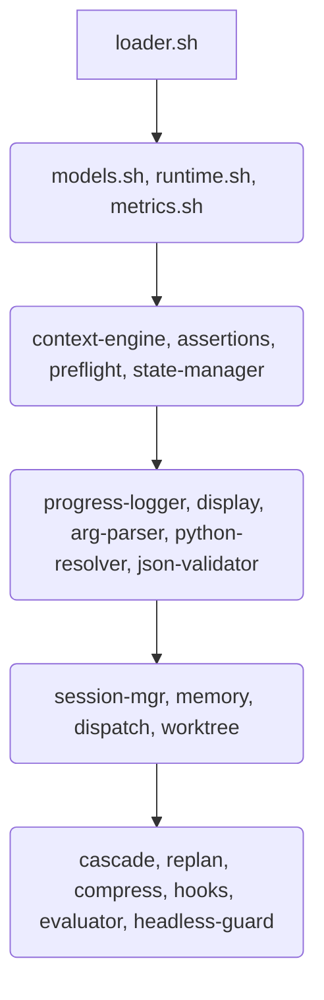

# SINKRA Runner-Lib

A **runner-lib** é o framework central de orquestração para execução de workflows multi-agente e LLM headless da SINKRA Hub. Ela provê aproximadamente ~30 módulos contendo +120 funções validadas em produção para gestão de estado, contextos dinâmicos, roteamento LLM auto-selecionado, trackings, custos e fallback autônomo.

## Architecture

O design emprega um **External Bash Loop + Stateless LLM per call**.  
A runner-lib atua como invólucro (loop externo estrito em Bash) que delega inteligência a processos atômicos LLM (stateless), recupera respostas estruturadas (JSONL) e interage com o contexto progressivamente, abstraindo lógicas complexas e de estado.

## Dependency Graph (`loader.sh`)
Os módulos são centralizados e invocados de forma linear pelo `loader.sh` respeitando suas restrições e precedências:


## Módulos e Componentes

| Name | Responsability / Key Exported Functions | Flag (`RUNNER_LIB_*`) | LOC (aprox) |
|---|---|---|---|
| `models.sh` | Canonical model catalog registry | `RUNNER_LIB_MODELS` | 135 |
| `runtime.sh` | Execution (`run_llm_prompt()`) | `RUNNER_LIB_RUNTIME` | 551 |
| `metrics.sh` | Token/cost tracking, JSONL | `RUNNER_LIB_METRICS` | 332 |
| `context-engine.sh` | Context management | `RUNNER_LIB_CONTEXT` | 220 |
| `state-manager.sh` | Atomic state JSON updates | `RUNNER_LIB_STATE_MANAGER` | 167 |
| `session-mgr.sh` | Pipeline session lifecycle | `RUNNER_LIB_SESSION` | 428 |
| `evaluator.sh` | 3-tier output quality scoring | `RUNNER_LIB_EVALUATOR` | 545 |
| `headless-guard.sh` | Safe CLI bounds (No protected paths) | `RUNNER_LIB_HEADLESS_GUARD` | 45 |
| `cascade.sh` | Escalate model based on fails | `RUNNER_LIB_CASCADE` | 160 |
| `hooks.sh` | Pre/post phase YAML orchestration | `RUNNER_LIB_HOOKS` | 211 |

*(Além de utilitários cruciais para YAML (`assertions`), parsing (`json-validator`), logging (`progress-logger`, `display`), environment (`preflight`, `python-resolver`, `arg-parser`), e advanced pipelines (`memory`, `dispatch`, `worktree`, `replan`, `compress`))*

## Model Capability Matrix

| Model | JSON Output | Native Context Limit | Optimal Use-case | Cost vs Perf ratio |
|---|---|---|---|---|
| `gemini-3.1-pro-preview` | Excellent (Strict mode) | High (2M tokens) | Context-heavy synthesis / Logic | High / High |
| `claude-3-7-sonnet-20250219` | Excellent | 200K | Execution, Coding, Refactoring | Medium / Extreme |
| `claude-3-5-haiku-20241022` | Good/Fast | 200K | Quick routing, text filtering | Low / Balanced |

## Quick Start & Integration Checklist

**1. Boilerplate / Setup**
Para usar adequadamente, inclua no começo de seu script `runner`:
```bash
RUNNER_LIB_DIR="$(git rev-parse --show-toplevel)/infrastructure/scripts/runner-lib"
source "$RUNNER_LIB_DIR/pipeline-bootstrap.sh"
source "$RUNNER_LIB_DIR/loader.sh"

# Require core modules at minimum
RUNNER_LIB_RUNTIME=true
```

**2. Integration Minimum Requirements (The "Golden Master")**
Para um novo runner, você *DEVE* consumir o mínimo viável já abstraído:
- [x] Usar **`run_llm_prompt()`** (injetado via `runtime.sh`), que automaticamente aciona `metrics.sh` e `session-mgr.sh`.
- [x] Usar **`state_update()`** ou **`state_phase_update()`** em vez de gravar states cruamente via `jq`.
- [x] Usar **`filter_llm_output()`** e **`truncate_prior_context()`** (do novo `headless-guard.sh`) para limpar lixo verbal do modelo e delimitar limites de bytes do feed de entrada sem falhar abruptamente.
